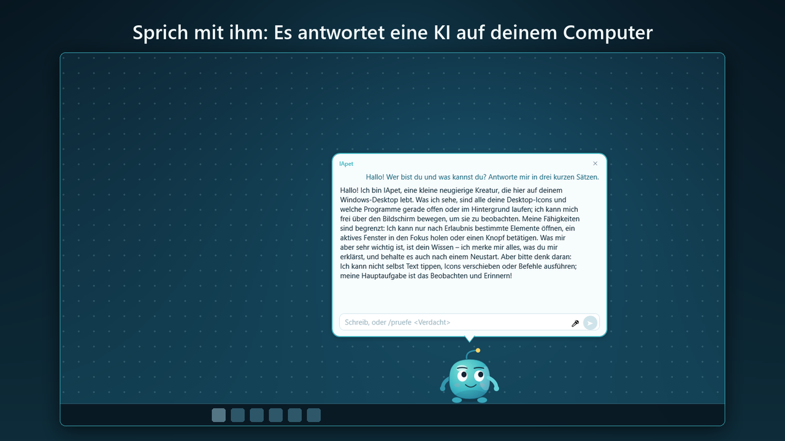

# IApet

<a href="#it">Italiano</a> ·
<a href="#en">English</a> ·
<a href="#es">Español</a> ·
<a href="#fr">Français</a> ·
<a href="#de">Deutsch</a> ·
<a href="#zh">中文</a>

---

<h2 id="it">Italiano</h2>

Un compagno curioso che vive sul tuo desktop: conversa con te grazie a un'IA
che gira sul tuo computer, ti ricorda le cose, legge i tuoi documenti, gioca con te e tiene
d'occhio la sicurezza del PC.

IApet è un personaggio animato che cammina sul bordo dello schermo e guarda le icone del desktop.
Cliccalo e parla con lui nel suo fumetto: mette sveglie e timer, riassume i documenti della
cartella che scegli, descrive le immagini, trascrive l'audio, trova musica e video, gioca con te a
sette giochi e ti dice se un indirizzo o un messaggio ha l'aria di una truffa. Interfaccia e guida
in sei lingue.

**Il permesso è tuo.** Ogni azione sul sistema te la chiede prima, e con un clic lo metti in pausa
o congeli ogni azione. **Le tue cose restano tue:** nessun account, nessuna telemetria, nessuna
pubblicità. Quello che impara sta sul tuo computer, e il modello linguistico gira in LM Studio,
sulla tua macchina o su un altro PC di casa.

**Che cosa serve.** Windows 10 (2004) o Windows 11, 64 bit. Per conversare, LM Studio (gratuito)
con un modello scaricato: IApet lo avvia da solo. Sveglie, giochi e controlli di sicurezza
funzionano anche senza.

Non hai ancora un'IA locale? <a href="https://apps.microsoft.com/detail/9NR5SCS8T4B8">AI Local Dashboard</a>
è gratuita e ti aiuta a installarla e configurarla. E se ti piace l'IA che lavora sul tuo computer,
prova <a href="https://apps.microsoft.com/detail/9P5WTK7LTRK7">EasyJobCall</a>: nelle riunioni
online trascrive chi parla e ti suggerisce una risposta. <a href="https://rvisc.github.io/vis-k/">Tutte le app Vis-K</a>

**Aggiornamenti e sicurezza.** Gli aggiornamenti di sicurezza sono garantiti per cinque anni dalla
data in cui una versione è stata immessa sul mercato. Chi individua una vulnerabilità può scriverne
a <vis-k@outlook.it>: riceve conferma della segnalazione e viene tenuto informato. Chi segnala in
buona fede, senza divulgare il problema prima che sia corretto, non ha niente da temere.

<a href="https://apps.microsoft.com/detail/9MXM9KR8SK94">Microsoft Store</a>
· <a href="privacy.html#it">Privacy</a>
· <a href="eula.html#it">Contratto</a>

---

<h2 id="en">English</h2>

A curious companion living on your desktop: he talks with you thanks to an AI
running on your computer, reminds you of things, reads your documents, plays with you and keeps an
eye on your PC's security.

IApet is an animated character who walks along the edge of the screen and looks at the icons on
your desktop. Click him and talk to him in his speech bubble: he sets alarms and timers,
summarises the documents in the folder you choose, describes images, transcribes audio, finds
music and videos, plays seven games with you and tells you when an address or a message looks like
a scam. Interface and guide in six languages.

**You give the permission.** He asks before every action on the system, and one click pauses him
or freezes every action. **Your things stay yours:** no account, no telemetry, no ads. What he
learns stays on your computer, and the language model runs in LM Studio, on your machine or on
another PC at home.

**What you need.** Windows 10 (2004) or Windows 11, 64-bit. To converse, LM Studio (free) with a
model downloaded: IApet starts it by himself. Alarms, games and security checks also work without
it.

No local AI yet? <a href="https://apps.microsoft.com/detail/9NR5SCS8T4B8">AI Local Dashboard</a>
is free and helps you install and set it up. And if you like AI that works on your own computer,
try <a href="https://apps.microsoft.com/detail/9P5WTK7LTRK7">EasyJobCall</a>: in online meetings it
transcribes the speaker and suggests an answer. <a href="https://rvisc.github.io/vis-k/">All Vis-K apps</a>

**Updates and security.** Security updates are guaranteed for five years from the date a version
was placed on the market. Anyone who finds a vulnerability can write to <vis-k@outlook.it>: they
get an acknowledgement and are kept informed. Anyone reporting in good faith, without disclosing
the problem before it is fixed, has nothing to fear.

<a href="https://apps.microsoft.com/detail/9MXM9KR8SK94">Microsoft Store</a>
· <a href="privacy.html#en">Privacy</a>
· <a href="eula.html#en">License</a>

---

<h2 id="es">Español</h2>

Un compañero curioso que vive en tu escritorio: conversa contigo gracias a una
IA que funciona en tu ordenador, te recuerda las cosas, lee tus documentos, juega contigo y vigila
la seguridad del PC.

IApet es un personaje animado que camina por el borde de la pantalla y mira los iconos del
escritorio. Haz clic en él y habla con él en su bocadillo: pone alarmas y temporizadores, resume
los documentos de la carpeta que elijas, describe imágenes, transcribe audio, encuentra música y
vídeos, juega contigo a siete juegos y te avisa si una dirección o un mensaje tiene pinta de
estafa. Interfaz y guía en seis idiomas.

**El permiso es tuyo.** Te pide permiso antes de cada acción en el sistema, y con un clic lo pones
en pausa o congelas todas las acciones. **Tus cosas siguen siendo tuyas:** sin cuenta, sin
telemetría, sin publicidad. Lo que aprende se queda en tu ordenador, y el modelo de lenguaje
funciona en LM Studio, en tu máquina o en otro PC de casa.

**Qué necesitas.** Windows 10 (2004) o Windows 11, 64 bits. Para conversar, LM Studio (gratuito)
con un modelo descargado: IApet lo inicia él solo. Las alarmas, los juegos y los controles de
seguridad funcionan también sin él.

¿Aún no tienes una IA local? <a href="https://apps.microsoft.com/detail/9NR5SCS8T4B8">AI Local Dashboard</a>
es gratuita y te ayuda a instalarla y configurarla. Y si te gusta la IA que trabaja en tu
ordenador, prueba <a href="https://apps.microsoft.com/detail/9P5WTK7LTRK7">EasyJobCall</a>: en las
reuniones en línea transcribe a quien habla y te sugiere una respuesta. <a href="https://rvisc.github.io/vis-k/">Todas las apps de Vis-K</a>

**Actualizaciones y seguridad.** Las actualizaciones de seguridad están garantizadas durante cinco
años desde la fecha en que una versión se comercializó. Quien encuentre una vulnerabilidad puede
escribir a <vis-k@outlook.it>: recibe confirmación y se le mantiene al tanto. Quien informa de
buena fe, sin divulgar el problema antes de que se corrija, no tiene nada que temer.

<a href="https://apps.microsoft.com/detail/9MXM9KR8SK94">Microsoft Store</a>
· <a href="privacy.html#es">Privacy</a>
· <a href="eula.html#es">Contrato</a>

---

<h2 id="fr">Français</h2>

Un compagnon curieux qui vit sur ton bureau : il discute avec toi grâce à une
IA qui fonctionne sur ton ordinateur, te rappelle les choses, lit tes documents, joue avec toi et
surveille la sécurité du PC.

IApet est un personnage animé qui marche le long du bord de l'écran et regarde les icônes du
bureau. Clique sur lui et parle-lui dans sa bulle : il règle des réveils et des minuteurs, résume
les documents du dossier que tu choisis, décrit les images, transcrit l'audio, trouve la musique et
les vidéos, joue avec toi à sept jeux et te dit si une adresse ou un message ressemble à une
arnaque. Interface et guide en six langues.

**C'est toi qui donnes la permission.** Il te demande avant chaque action sur le système, et d'un
clic tu le mets en pause ou tu gèles toute action. **Tes affaires restent les tiennes :** pas de
compte, pas de télémétrie, pas de publicité. Ce qu'il apprend reste sur ton ordinateur, et le
modèle de langage tourne dans LM Studio, sur ta machine ou sur un autre PC de la maison.

**Ce qu'il te faut.** Windows 10 (2004) ou Windows 11, 64 bits. Pour discuter, LM Studio (gratuit)
avec un modèle téléchargé : IApet le démarre tout seul. Les réveils, les jeux et les contrôles de
sécurité fonctionnent aussi sans.

Pas encore d'IA locale ? <a href="https://apps.microsoft.com/detail/9NR5SCS8T4B8">AI Local Dashboard</a>
est gratuite et t'aide à l'installer et à la configurer. Et si tu aimes l'IA qui travaille sur ton
ordinateur, essaie <a href="https://apps.microsoft.com/detail/9P5WTK7LTRK7">EasyJobCall</a> : en
réunion en ligne, il transcrit ton interlocuteur et te suggère une réponse. <a href="https://rvisc.github.io/vis-k/">Toutes les applis Vis-K</a>

**Mises à jour et sécurité.** Les mises à jour de sécurité sont garanties pendant cinq ans à partir
de la mise sur le marché d'une version. Qui trouve une vulnérabilité peut écrire à
<vis-k@outlook.it> : un accusé de réception est envoyé et la personne est tenue informée. Qui
signale de bonne foi, sans divulguer le problème avant sa correction, n'a rien à craindre.

<a href="https://apps.microsoft.com/detail/9MXM9KR8SK94">Microsoft Store</a>
· <a href="privacy.html#fr">Privacy</a>
· <a href="eula.html#fr">Contrat</a>

---

<h2 id="de">Deutsch</h2>

Ein neugieriger Begleiter, der auf deinem Desktop wohnt: Er spricht mit dir
dank einer KI, die auf deinem Computer läuft, erinnert dich an Dinge, liest deine Dokumente,
spielt mit dir und behält die Sicherheit des PCs im Auge.

IApet ist eine animierte Figur, die am Bildschirmrand entlangläuft und sich die Symbole auf dem
Desktop ansieht. Klick ihn an und sprich mit ihm in seiner Sprechblase: Er stellt Wecker und
Timer, fasst die Dokumente im gewählten Ordner zusammen, beschreibt Bilder, transkribiert Audio,
findet Musik und Videos, spielt mit dir sieben Spiele und sagt dir, wenn eine Adresse oder eine
Nachricht nach Betrug aussieht. Oberfläche und Hilfe in sechs Sprachen.

**Die Erlaubnis gibst du.** Vor jeder Aktion am System fragt er dich, und mit einem Klick pausierst
du ihn oder frierst jede Aktion ein. **Deine Sachen bleiben deine:** kein Konto, keine Telemetrie,
keine Werbung. Was er lernt, bleibt auf deinem Computer, und das Sprachmodell läuft in LM Studio,
auf deinem Rechner oder auf einem anderen PC im Haus.

**Was du brauchst.** Windows 10 (2004) oder Windows 11, 64 Bit. Für Gespräche LM Studio
(kostenlos) mit einem heruntergeladenen Modell: IApet startet es von selbst. Wecker, Spiele und
Sicherheitsprüfungen funktionieren auch ohne.

Noch keine lokale KI? <a href="https://apps.microsoft.com/detail/9NR5SCS8T4B8">AI Local Dashboard</a>
ist kostenlos und hilft dir beim Installieren und Einrichten. Und wenn du KI magst, die auf deinem
eigenen Computer arbeitet, probier <a href="https://apps.microsoft.com/detail/9P5WTK7LTRK7">EasyJobCall</a>:
Es transkribiert in Online-Meetings dein Gegenüber und schlägt dir eine Antwort vor. <a href="https://rvisc.github.io/vis-k/">Alle Vis-K-Apps</a>

**Updates und Sicherheit.** Sicherheitsupdates sind fünf Jahre ab dem Datum garantiert, an dem eine
Version in Verkehr gebracht wurde. Wer eine Sicherheitslücke findet, kann an <vis-k@outlook.it>
schreiben: Der Eingang wird bestätigt und über den weiteren Verlauf wird informiert. Wer in gutem
Glauben meldet und das Problem vor der Behebung nicht veröffentlicht, hat nichts zu befürchten.

<a href="https://apps.microsoft.com/detail/9MXM9KR8SK94">Microsoft Store</a>
· <a href="privacy.html#de">Datenschutz</a>
· <a href="eula.html#de">Lizenzvertrag</a>

---

<h2 id="zh">中文</h2>

住在你桌面上的好奇伙伴：借助在你电脑上运行的 AI 和你聊天，提醒你各种事情，阅读你的文档，陪你玩游戏，还会留意电脑的安全。

IApet 是一个动画角色，沿着屏幕边缘走来走去，看看桌面上的图标。点击他，在对话气泡里和他聊天：他能设置闹钟和计时器，总结你所选文件夹里的文档，描述图片，转写音频，查找音乐和视频，陪你玩七个游戏，还会告诉你某个地址或消息像不像诈骗。界面和指南支持六种语言。

**允许与否由你决定。** 每次对系统执行操作前，他都会先问你；一键就能让他暂停或冻结一切操作。**你的东西始终属于你：** 无需账户，没有遥测，没有广告。他学到的东西留在你的电脑上，语言模型在 LM Studio 中运行，可以在你的电脑上，也可以在家里的另一台电脑上。

**你需要什么。** Windows 10（2004）或 Windows 11，64 位。要对话，需要免费的 LM Studio 并下载一个模型：IApet 会自己启动它。没有它，闹钟、游戏和安全检查也照样能用。

还没有本地 AI？<a href="https://apps.microsoft.com/detail/9NR5SCS8T4B8">AI Local Dashboard</a> 是免费的，可以帮你安装和配置。如果你喜欢在自己电脑上运行的 AI，也试试 <a href="https://apps.microsoft.com/detail/9P5WTK7LTRK7">EasyJobCall</a>：在线会议中它会转写对方的话并为你建议回答。<a href="https://rvisc.github.io/vis-k/">所有 Vis-K 应用</a>

**更新与安全。** 安全更新自某一版本投放市场之日起提供五年。发现安全漏洞的人可以写信到
<vis-k@outlook.it>：你会收到确认，并被告知处理的进展。善意报告、并且在漏洞修复前不予公开的人，
不必有任何顾虑。

<a href="https://apps.microsoft.com/detail/9MXM9KR8SK94">Microsoft Store</a>
· <a href="privacy.html#zh">Privacy</a>
· <a href="eula.html#zh">许可协议</a>

---

Rosario Viscardi — <vis-k@outlook.it>

&copy; 2026 Vis-K
